# BUDGET & FINANCIAL SOLUTIONS APP

## QUESTION R3
GitHub Link to Sourc Control Repository:
https://github.com/Anup-SoftwareDev/Budget-Solutions

## QUESTION R5 - PURPOSE AND SCOPE

### What it does?
This Application allows a user to enter his/her **current incomes**,**expenses**, Investment income and "years to invest" at different times. From the information provided the application can device the following for the user:

- Current Budget Situation - Defecit or Shortfall?
- Recommended Budget Solutions - Recommended Ways to Improve Budget.
- Customised Budget Solutions - Budget Solutions based on Customer prefference.
- Investment Solutions & Possible future Growth figures - Display options on how to invest the user's investment income and how much it could grow by in the future.

### Problem Identification and Solution:

In todays uncertain times Budget and Financial solutions are needed for almost everybody. However not everybody can either afford the cost or the time to go throgh the conventional methods to obtain solutions. Hence it was improtant to create an Budget and Financial Solutions Application that the following benefits:

- **Quick:** This application provides solutions with a click of the button. This is far quicker than having to make appointments with financial advicers and having an hour long appointment.
- **Convenient:** It can be used on your tablet, computer or mobile at any time it is convinient for you, as opposed to having to make appointments in times when it is convineint for the user and the consultant.
- **Easy to use:** : The menu system is uses expencts simple entries such as "Y" or "N" or numbers which is straightford for anybody of any age and educational background.
- **Affordable:** : The app would either be free or very cheap to download and hence will cost a lot less than the hourly rate of a consultant. This was important because fiancial solutions are normally too expensive to for the peopele that need it the most.
- **Accessible:** As mentioned before it is accessible on any device at any time and all you need is a few minutes. 
- **Ensures privacy:** This ensure that your financial information does not have to be shared with anybody which is important to ensure privacy of personal information but also for individuals that are not too keen to let others know of their uncomfortable financial position.

### Target Audience

The Target Audinece can be families and individuals who is seeking to improve their budget situation and would also like a starting point into looking at some investment Options for the future. It can be people/groups of people who for, some reason do not want to/do not have the time to/are need to do some self research before meeting up with a financial advicer. 

### How to use the APP

The user have to go throgh the following steps:
1. Download all "Budget_Solutions" files into your local drive.
2. Type "./runner.sh" in your Command prompt.
3. Type "Y" to start Budget Solutions.
4. Enter values for the user's Income/week for the following different categories:
    1. Wages/Salary
    2. Rental Income
    3. Invest Income
    4. Other Income
5. Enter values for the user's Expenses/week for the following different categories:
    1. Groceries
    2. School Fees
    3. Shopping 
    4. Entertainment
    5. Rent/Mortgage
    6. Other Expenses
6. Once Budget Result is displayed, Type "Y" if budget solution is required and "N" if user wants to exit application.
7. If "Y" is selected then type either one of the following:
    * 1 - The Application's Recommended budget Solution or
    * 2 - To Creat your own Budget Solution
8. If "1" is typed the Recommended solution is displayed.
9. If "2" is typed then selecg either one of the following:
    * 1 - Reduce Expenses
    * 2 - Increase Income
10. Selecting "1" will display categories shown in Step 5 while selecting "2" will display categories shown in Step 4.
11. Select any of the categories from Step 10 and then type one of the following to either Reduce an Expense/Increase an Income by the shown amount:
    * 1 - 5%
    * 2 - 10%
    * 3 - 20%
12. Then select "Y" to continue increasin income/decreasong or "N" to move to next Menu.
13. After "N" selected then either:
    * Select "Y" for investment Advice
    * Select "N" for exit.
14. If "Y" is selected Enter user's inteneded Investment Income.
15. Then enter number of years to invest.
17. Final report "Report.txt" is output.

## QUESTION R6 - APPLICATION FEATURES

### A. Budget Result
This is the feature of the code where the user's current budget Result is displayed after entering all his/her current income and expense details. As shown in the image below the user enters various inputs for the different categories of Incomes and Expenses through the command prompt. These values are saved into two separate arrays that hold income and expense details. Then the difference in sum of the elements in each of the arrays are displayed both in the command prompt and Report.txt.

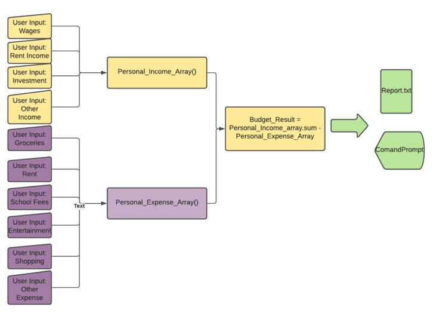

Error handling here is taken care of at the inputs by ensuring that only necessary integers are allowed to be entered by the user.

### B. User Driven Budget Solution

The user-driven budget solution as shown in the flow diagram below allows the user to choose either the Increase Income solution/or the Reduce Expense solution. Once this is chosen then the user is prompted to choose the specific category (wages, rent and so on). Once the category is chosen then the user can either increase(for income) or decrease(for Expense) the value by one of the following:

1. 5%
2. 10%
3. 20%

Then the user has the choice to implement the same operation on another income or expense category. The user is allowed to do this until he/she chooses to stop. Once this is chosen then the process moves the the next feature. 

Error-handling is taken care of at all inputs to make sure that the user only enther integers where necessary and either a "Y" or "N" where necessary.

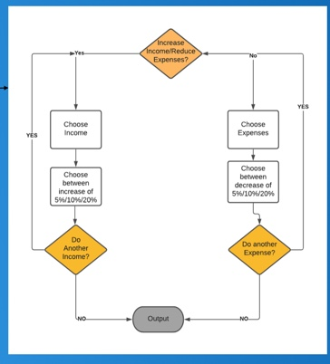

### C. Application(Recommended) Budget Solution

This Budget solution is created by and an algorithm program written in the application. The flow diagram for the algorithm is shown in the image below. The Main features of the algorithm are the following:

* Expenses are given priority to reduce before Increasing Income.
* Within Expenses the priority order for reduction is the following:
    * Entertainment 
    * Shopping
    * Groceries
    * Other Expenses
    * Rent
    * School Fees
    
This information is stored in an arra called Expense_Priority_arr.
* Within income the priority order for increase is the following:
    * Wages 
    * Investment Income
    * Rental Income
    * Other Income

    This information is stored in an array called Income_Priority_arr.

* After every increase and reduction of each category it is checked if the new budgeted income is 20% greater than the budgeted expense.
* It is also checked if each category has been reduced more than 40%/increased more thatn 30% because values beyond that are deemed to be unreasonable.
* Once the above two conditions are achieved the budget solution is reached based on what has been done so far.
    

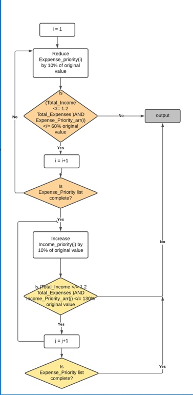
### D. Investment Solution

This feature is demonstrated in the picture below:
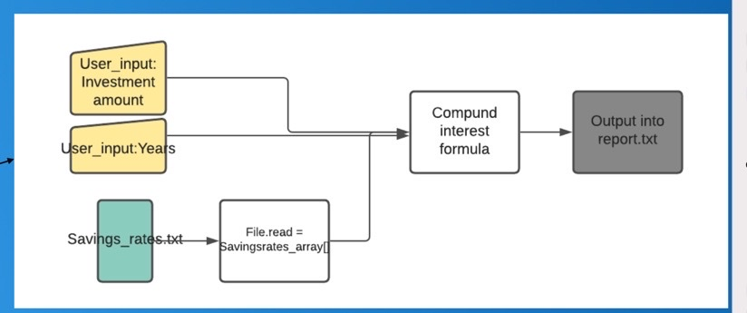

As shown the user inputs his/her investment amount and and then number of years the user plans to invest it. The different rates at which the investment grows are stored in a file and read from it. The result is output using a Compound interes formula.

## QUESTION R7 - USER INTERACTION AND EXPERIENCE

1. Download all "Budget_Solutions" files into your local drive.
2. After downloading "Budget_Solutions" files into the user's personal drive user will have to  Type "./runner.sh" in the user's Command prompt and it will Launch the application as shown below:

This gives the user a welcome message and asks the user if the user needs a solution for his/her budget.
3. Type "Y" to start Budget Solutions which will give the following result to allow the user to enter values for expense and income categories mentioned in Question R5:
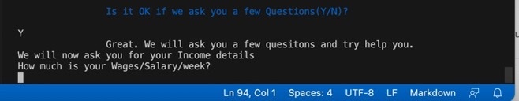
4. **Error handling** is dealt with here. As shown in the image below, if the user Enters a non-integer value the application will keep insisting that the user enters Integer values. As it can be notice the menu only moves to the next category once an integer is put in:

    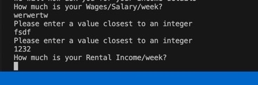

5. Budget Result is displayed and the next question requesting for budget solution is displayed, as shown below:

    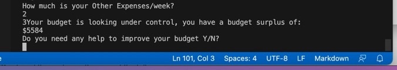

6. **Error handling** is dealt with here again. As shown in the image below, if the user Enters a value other than "Y" or "N" the application will keep insisting that the user enters the correct values. As it can be noticed the menu only moves to the next menu if the user enters the correct inputs as shown below:

    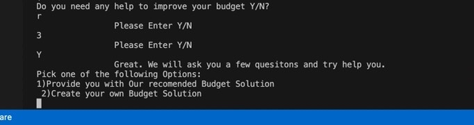

7. If "1" is typed the Recommended solution is displayed as shown below and the next Menu is on investment is dealt with:
    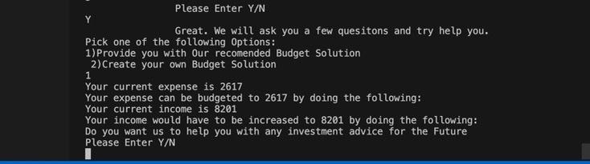

**Error handling** is dealt with here again as in step 4.

8. If "2" is typed then the following is displayed:
    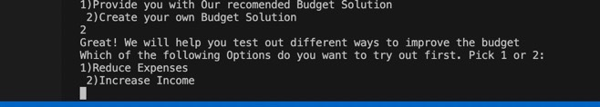
  
9. Selecting "1" or "2" will display the either the full Income or Expense category list as shown below:
    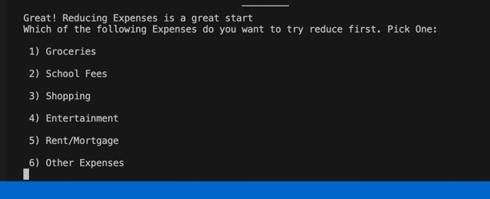

    **Error handling** is dealt with here again as in step 4.
     

10. Select any of the categories from Step 10 and then type one of the following to either Reduce an Expense/Increase an Income by the shown amount:
    * 1 - 5%
    * 2 - 10%
    * 3 - 20%
This is shown below:

**Error handling** is dealt with here again as in step 4.

11. Once one of the numbers is selected above then select "Y" to continue increasing income/decreasing or "N" to move to next Menu as shown below: 
    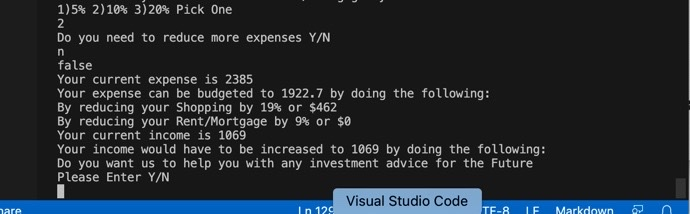
As shown above the final budget solution is displayed and user is prompeted for budget solutions.

**Error handling** is dealt with here again as in step 6.

12. After "N" selected then either:
    * Select "Y" for investment Advice
    * Select "N" for exit.
**Error handling** is dealt with here again as in step 6.

13. Once "Y" is selected the user has to enter the investment amount and the number of years as shown below. It then prints it out in Report.txt and the comand prompt as shown below:

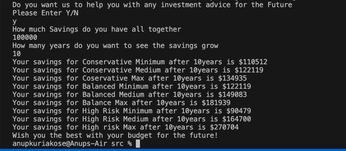

**Error handling** is dealt with here again as in steps 4 and 6. 

## QUESTION R8 - CONTROL FLOW OF APPLICAITON

Details within each block are expanded in the answers to Question R6 Above.

## QUESTION R9 - PROJECT IMPLEMENTATION PLAN
Project Plan is managed with Trello sofware and the link to the plan is https://trello.com/b/ZmrwGmDO/budget-investment-solutions.
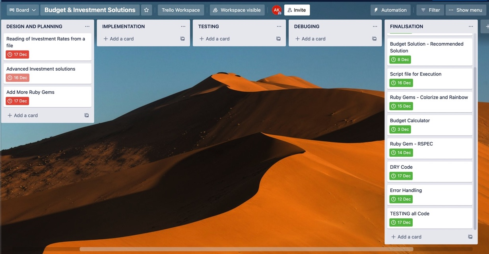

## QUESTION R10 - APPLICATON HELP DOCUMENTATION

### **A. Steps to Install and Run:**
1. Download all "Budget_Solutions" files into your local drive.

2. Type "./runner.sh" in your Command prompt.

### **B. Application Dependencies:**

1. Ruby Version - ruby 3.0.2p107 (2021-07-07 revision 0db68f0233) [arm64-darwin20]
2. Ruby gem "colorize", "~> 0.8.1"
3. Ruby gem "rainbow", "~> 3.0"
4. Ruby gem "rspec", "~> 3.10"

### **C. System/Hardware Requirements:**

1. Operating System:  macOS BigSur Version 11.6
2. Hardware: MacBook Air(M1, 2020)
3. Chip: M1
4. Memory: 8GB

 
