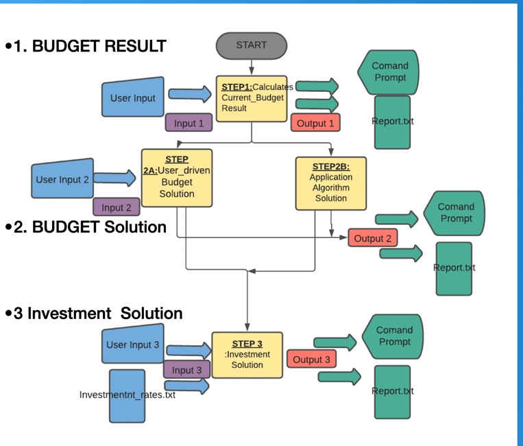

# BUDGET & FINANCIAL SOLUTIONS APP

## QUESTION R3
GitHub Link to Sourc Control Repository:
https://github.com/Anup-SoftwareDev/Budget-Solutions

## QUESTION R5 - PURPOSE AND SCOPE

### What it does?
This Application allows a user to enter his/her **current incomes**,**expenses**, Investment income and "years to invest" at different times. From the information provided the application can device the following for the user:

- Current Budget Situation - Defecit or Shortfall?
- Recommended Budget Solutions - Recommended Ways to Improve Budget.
- Customised Budget Solutions - Budget Solutions based on Customer prefference.
- Investment Solutions & Possible future Growth figures - Display options on how to invest the user's investment income and how much it could grow by in the future.

### Problem Identification and Solution:

In todays uncertain times Budget and Financial solutions are needed for almost everybody. However not everybody can either afford the cost or the time to go throgh the conventional methods to obtain solutions. Hence it was improtant to create an Budget and Financial Solutions Application that the following benefits:

- **Quick:** This application provides solutions with a click of the button. This is far quicker than having to make appointments with financial advicers and having an hour long appointment.
- **Convenient:** It can be used on your tablet, computer or mobile at any time it is convinient for you, as opposed to having to make appointments in times when it is convineint for the user and the consultant.
- **Easy to use:** : The menu system is uses expencts simple entries such as "Y" or "N" or numbers which is straightford for anybody of any age and educational background.
- **Affordable:** : The app would either be free or very cheap to download and hence will cost a lot less than the hourly rate of a consultant. This was important because fiancial solutions are normally too expensive to for the peopele that need it the most.
- **Accessible:** As mentioned before it is accessible on any device at any time and all you need is a few minutes. 
- **Ensures privacy:** This ensure that your financial information does not have to be shared with anybody which is important to ensure privacy of personal information but also for individuals that are not too keen to let others know of their uncomfortable financial position.

### Target Audience

The Target Audinece can be families and individuals who is seeking to improve their budget situation and would also like a starting point into looking at some investment Options for the future. It can be people/groups of people who for, some reason do not want to/do not have the time to/are need to do some self research before meeting up with a financial advicer. 

### How to use the APP

The user have to go throgh the following steps:
1. Download all "Budget_Solutions" files into your local drive.
2. Type "./runner.sh" in your Command prompt.
3. Type "Y" to start Budget Solutions.
4. Enter values for the user's Income/week for the following different categories:
    1. Wages/Salary
    2. Rental Income
    3. Invest Income
    4. Other Income
5. Enter values for the user's Expenses/week for the following different categories:
    1. Groceries
    2. School Fees
    3. Shopping 
    4. Entertainment
    5. Rent/Mortgage
    6. Other Expenses
6. Once Budget Result is displayed, Type "Y" if budget solution is required and "N" if user wants to exit application.
7. If "Y" is selected then type either one of the following:
    * 1 - The Application's Recommended budget Solution or
    * 2 - To Creat your own Budget Solution
8. If "1" is typed the Recommended solution is displayed.
9. If "2" is typed then selecg either one of the following:
    * 1 - Reduce Expenses
    * 2 - Increase Income
10. Selecting "1" will display categories shown in Step 5 while selecting "2" will display categories shown in Step 4.
11. Select any of the categories from Step 10 and then type one of the following to either Reduce an Expense/Increase an Income by the shown amount:
    * 1 - 5%
    * 2 - 10%
    * 3 - 20%
12. Then select "Y" to continue increasin income/decreasong or "N" to move to next Menu.
13. After "N" selected then either:
    * Select "Y" for investment Advice
    * Select "N" for exit.
14. If "Y" is selected Enter user's inteneded Investment Income.
15. Then enter number of years to invest.
17. Final report "Report.txt" is output.

## QUESTION R6 - APPLICATION FEATURES

### A. Budget Result
This is the feature of the code where the user's current budget Result is displayed after entering all his/her current income and expense details.

### B. User Driven Budget Solution

### C. Application(Recommended) Budget Solution

### D. Investment Solution

### E. Other Features

## QUESTION R7 - USER INTERACTION AND EXPERIENCE

1. Download all "Budget_Solutions" files into your local drive.
2. After downloading "Budget_Solutions" files into the user's personal drive user will have to  Type "./runner.sh" in the user's Command prompt and it will Launch the application as shown below:

This gives the user a welcome message and asks the user if the user needs a solution for his/her budget.
3. Type "Y" to start Budget Solutions which will give the following result to allow the user to enter values for expense and income categories mentioned in Question R5:

4. **Error handling** is dealt with here. As shown in the image below, if the user Enters a non-integer value the application will keep insisting that the user enters Integer values. As it can be notice the menu only moves to the next category once an integer is put in:

    

5. Budget Result is displayed and the next question requesting for budget solution is displayed, as shown below:

    

5. Once Budget Result is displayed, Type "Y" if budget solution is required and "N" if user wants to exit application.
7. If "Y" is selected then type either one of the following:
    * 1 - The Application's Recommended budget Solution or
    * 2 - To Creat your own Budget Solution
8. If "1" is typed the Recommended solution is displayed.
9. If "2" is typed then selecg either one of the following:
    * 1 - Reduce Expenses
    * 2 - Increase Income
10. Selecting "1" will display categories shown in Step 5 while selecting "2" will display categories shown in Step 4.
11. Select any of the categories from Step 10 and then type one of the following to either Reduce an Expense/Increase an Income by the shown amount:
    * 1 - 5%
    * 2 - 10%
    * 3 - 20%
12. Then select "Y" to continue increasin income/decreasong or "N" to move to next Menu.
13. After "N" selected then either:
    * Select "Y" for investment Advice
    * Select "N" for exit.
14. If "Y" is selected Enter user's inteneded Investment Income.
15. Then enter number of years to invest.
17. Final report "Report.txt" is output.

## QUESTION R8 - CONTROL FLOW OF APPLICAITON

Details within each block are expanded in the answers to Question R6 Above.

## QUESTION R9 - PROJECT IMPLEMENTATION PLAN
Project Plan is managed with Trello sofware and the link to the plan is https://trello.com/b/ZmrwGmDO/budget-investment-solutions.

## QUESTION R10 - APPLICATON HELP DOCUMENTATION

### **A. Steps to Install and Run:**
1. Download all "Budget_Solutions" files into your local drive.

2. Type "./runner.sh" in your Command prompt.

### **B. Application Dependencies:**

1. Ruby Version - ruby 3.0.2p107 (2021-07-07 revision 0db68f0233) [arm64-darwin20]
2. Ruby gem "colorize", "~> 0.8.1"
3. Ruby gem "rainbow", "~> 3.0"
4. Ruby gem "rspec", "~> 3.10"

### **C. System/Hardware Requirements:**

1. Operating System:  macOS BigSur Version 11.6
2. Hardware: MacBook Air(M1, 2020)
3. Chip: M1
4. Memory: 8GB

 
